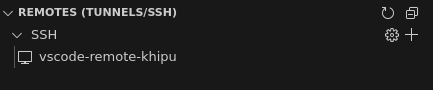

[remote-ssh]: https://marketplace.visualstudio.com/items?itemName=ms-vscode-remote.remote-ssh
[uso-nodo-acceso]: /guia-de-usuario/enviar-jobs/#uso-del-nodo-de-acceso
[ds001]: /info/infraestructura/#ds001
[data-science]: /guia-de-usuario/enviar-jobs/particiones/#data-science
[visual-studio]: https://code.visualstudio.com/
[vscode-remote-hpc]: https://github.com/khipu-utec/vscode-remote-hpc
[google-colab]: https://colab.research.google.com/
[enviar-jobs]:/guia-de-usuario/enviar-jobs/
[tensorboard]: https://www.tensorflow.org/tensorboard


# Visual Studio Code Remoto en Khipu

En este tutorial vamos a mostrar cómo conectarse a un nodo de cómputo de Khipu usando [Remote - SSH][remote-ssh]. [Remote - SSH][remote-ssh], es una extensión de [Visual Studio][visual-studio] que facilita la conexión a un servidor remoto a través del protocolo SSH. A través de esta herramienta es posible:

- Crear, editar y eliminar archivos de manera directa en el servidor remoto.
- Copiar archivos locales al servidor remoto usando `drag-and-drop`.
- Descargar sus archivos remotos.
- Crear sesiones de terminal y ejecutar comandos.
- Redirección automática de puertos, y más.


Hasta ahora todo esto era posible de hacer solamente en el nodo líder. Sin embargo, su uso se limitaba a la [ejecución de tareas administrativas y comandos cortos][uso-nodo-acceso]. A partir de ahora será posible obtener los beneficios listados directamente en un nodo de cómputo. Y lo mejor de todo es que cada sesión se instanciará de manera automática a un job en Slurm. 

!!! info
    Por el momento, el único nodo habilitado para este fin será el nodo [ds001][ds001] de la particion de [data-science][data-science]. Cada sesión contará con un reserva de **8 núcleos CPU, 32GB de RAM, 4 shards de GPU y un tiempo límite de 4 horas**. No es posible tener más de una sesión por usuario y una vez acabado el tiempo límite, se tendrá que instanciar nuevamente la sesión. 


A continuación se muestran los pasos a seguir para configurar nuestra sesión de [Visual Studio][visual-studio] directamente en un nodo de cómputo.

## Instalación

### Requisitos

- [Visual Studio Code][visual-studio]
- [Remote - SSH][remote-ssh]

Para instanciar nuestro [Visual Studio][visual-studio] haremos uso del script [vscode-remote-hpc][vscode-remote-hpc] que fue adaptado para su funcionamiento en Khipu. Este script se encargará de configurar una sesión de [Remote - SSH][remote-ssh], a partir del cual usted podrá iniciar un batch job, o reusar uno existente, directamente desde su [Visual Studio][visual-studio]. Este script funciona para Linux :fontawesome-brands-linux:, Windows :material-microsoft-windows: y Mac :fontawesome-brands-apple:. 

=== ":fontawesome-brands-linux: Linux y  :fontawesome-brands-apple:  MacOS"
    
    - Abrimos una sesión de terminal y ejecutaremos el siguiente comando:

    ```bash
    curl -fsSL https://raw.githubusercontent.com/khipu-utec/vscode-remote-hpc/refs/heads/main/client/setup.sh | bash
    ```
    - Seguiremos los pasos que se nos indique en pantalla, tal y como se muestra a continuación:

    

=== ":material-microsoft-windows: Windows"

    - Abrimos una sesión de PowerShell y ejecutaremos el siguiente comando: 

    ``` PowerShell
    irm https://raw.githubusercontent.com/khipu-utec/vscode-remote-hpc/refs/heads/main/client/setup.ps1 | iex
    ```

    - Seguiremos los pasos que se nos indique en pantalla, tal y como se muestra a continuación:

    

## ¿Cómo Usar?

Una vez realizado el paso anterior, `vscode-remote-khipu` estará disponible en el *Remote Explorer* de [Visual Studio][visual-studio].




Al hacer click en él, automáticamente se lanzará un *batch* job en Khipu. Deberemos esperar unos momentos hasta que el job se inicie y podamos conectarnos a él. Si nos conectamos al cluster y observamos la fila de slurm con `squeue --me` notaremos que existe un nuevo job llamado `vscode-remote`. 

!!! info
    Si no logramos observar nuestro job, es probable que se deba a que la fila de acceso a ese nodo ya se llenó y debamos intentar más tarde. 

Luego que la sesión termine de configurarse, podremos seleccionar un directorio para trabajar y usar nuestro [Visual Studio][visual-studio] remoto. Puede crear previamente un directorio para trabajar, o hacerlo directamente desde su `$HOME`.

Es importante mencionar que el job permanecerá en ejecución hasta que el tiempo límite se alcance. Es por ello que sí termina antes del tiempo límite, deberá cancelar su job manualmente para liberar espacio en la cola. Recuerde que el cluster es un compartido por todos y por ello debemos hacer un uso responsable y empático de sus recursos. 

!!! warning 
    :warning: Cerrar su [Visual Studio][visual-studio] no cancela automáticamente su job, deberá hacerlo de manera manual!

### ¿Como terminar mi sesión?

Para cancelar su job puede hacerlo con el clásico `scancel <job-id>` usando el `job-id` de su sesión, o ejecutando:

``` bash
vscode-remote cancel
```

## Recomendaciones Generales

Actualmente, estamos experimentando con esta nueva herramienta y lo estamos haciendo únicamente en el nodo [ds001][ds001] de la particion de [data-science][data-science]. Ese nodo cuenta con GPU y acceso a internet (a diferencia de los demás nodos de cómputo). Nuestra intención es que este nodo sirva para ejecutar notebooks de Python de manera similar a como se realiza en [Google Colab][google-colab], sin embargo no contamos con recursos infinitos para poder proveer un acceso ilimitado a las sesiones en Visual Studio. Es por ello que dejamos las siguientes recomendaciones.

- Si va a ejecutar trabajos de Inteligencia Artificial, use este nodo para configurar su `virtual enviroment`, instalar sus dependencias, descargar sus datos, visualizar la cantidad de parámetros que serán optimizados y hacer una prueba inicial de la ejecución de su modelo. 
- Si ve que su modelo tiene una gran cantidad de parámetros (mayor a 4GB de GPU RAM) y/o demorará en ejecutarse, genere su script en Slurm y [mándelo de la manera tradicional][enviar-jobs].
- No genere una sesión para empezar a codear su modelo desde cero. Recuerde que cada sesión reserva una cantidad grande de recursos que serían mal aprovechados realizando esa tarea. Puede usar herramientas como [Google Colab][google-colab] para codear sus modelos y una vez listos, traerlos a Khipu para su ejecución. Recuerde que, al igual que usted, hay alguien más esperando por usar Khipu.
- No olvide cerrar su sesión al término de su trabajo.
